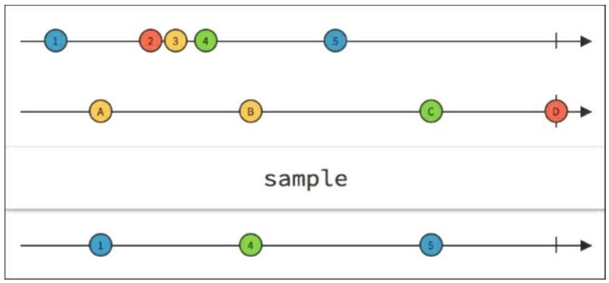

# Sampling

让我们回到那个温度传感器。它每秒发射当前室内的温度。说实话，我们并不认为温度会变化这么快，我们可以使用一个小的发射间隔。在Observable后面加一个`sample()`，我们将创建一个新的可观测序列，它将在一个指定的时间间隔里由Observable发射最近一次的数值：

```java
Observable<Integer> sensor = [...]

sensor.sample(30,TimeUnit.SECONDS)
    .subscribe(new Observable<Integer>() {

        @Override
        public void onCompleted() {
           
        }

        @Override
        public void onError(Throwable e) {
            
        }

        @Override
        public void onNext(Integer currentTemperature) {
            updateDisplay(currentTemperature)
        }
    });
```
例子中Observable将会观测温度Observable然后每隔30秒就会发射最后一个温度值。很明显，`sample()`支持全部的时间单位：秒，毫秒，天，分等等。

下图中展示了一个间隔发射字母的Observable如何采样一个发射数字的Observable。Observable的结果将会发射每个已发射字母的最后一组数据：1，4，5.



如果我们想让它定时发射第一个元素而不是最近的一个元素，我们可以使用`throttleFirst()`.


