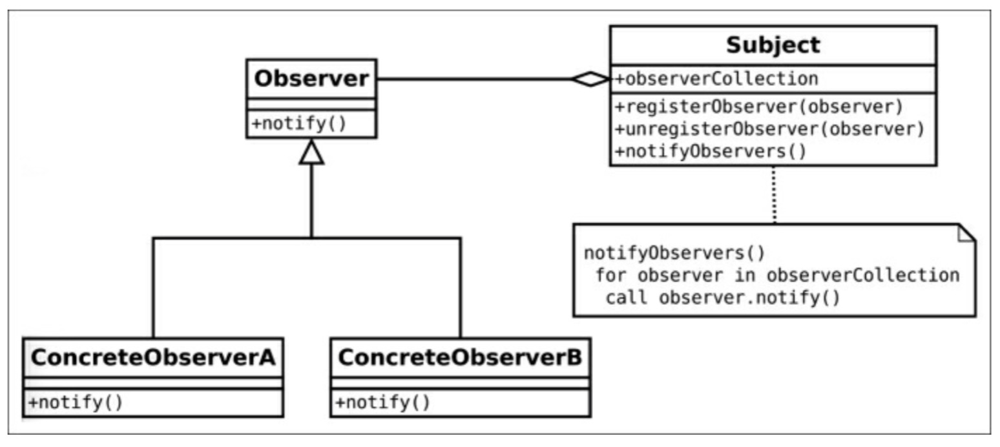

# 观察者模式

在今天，观察者模式是出现的最常用的软件设计模式之一。它基于subject这个概念。subject是一种特殊对象，当它改变时，那些由它保存的一系列对象将会得到通知。而这一系列对象被称作Observers,它们会对外暴漏了一个通知方法,当subject状态发生变化时会调用的这个方法。

在上一章中，我们看到了电子表单的例子。现在我们可以展开这个例子讲，展示一个更复杂的场景。让我们考虑这样一个填着账户数据的电子表单。我们可以把这些数据比作一张表，或者是3D柱状图，或者是饼状图。它们中每一个代表的意义都取决于同一组要展示的数据。每一个都是一个观察者，都依赖于那一个subject，维护着全部信息。

3D柱状图这个类、饼状图类、表这个类以及这些类维护这些数据：它们彼此相互独立复用，但也能协同工作。这些表示类彼此不清楚对方，但是正如它们所做的：它们知道在哪能找到它们需要展示的信息，它们也知道一旦数据发生变化就通知需要更新数据表示的那个类。

这有一张表描述了Subject/Observer的关系是怎样的一对多的关系：

上面这张表展示了一个Subject为3个Observers提供服务。很明显，没有理由限制Observers的数量：如果有需要，一个Subject可以有无限多个Observers,当subject状态发生变化时，这些Observers中的每一个都会收到通知。